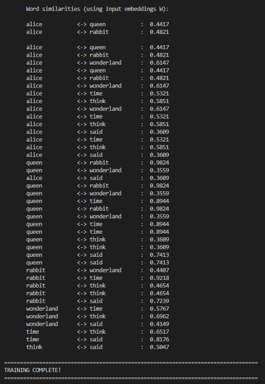

# Word2Vec from Scratch (CBOW + Negative Sampling)

This project implements **Word2Vec (CBOW with Negative Sampling)** entirely from scratch using NumPy - without deep learning frameworks.

The goal of this project is to deeply understand the mathematics behind word embeddings, including forward pass computation, loss formulation, and full gradient derivation.
The corpus used for this project is a transcript of "Alice's Adventures in Wonderland" by Lewis Carroll from Project Gutenberg.

---

## Features

- Text preprocessing and tokenization  
- Vocabulary construction and indexing  
- Negative sampling distribution (0.75 power as in the original paper)  
- CBOW forward pass implementation  
- Manual loss computation  
- Full gradient derivation and parameter updates  
- Training loop with embedding optimization  
- Similarity evaluation using cosine similarity  

---

## Example Output

Below is an example output produced by the training script:

---
